# 💻 MintLab

MintLab adalah platform browser-based IDE yang memungkinkan siapa saja untuk membuat dan deploy token crypto (ERC20) atau koleksi NFT (ERC721) langsung dari browser, tanpa perlu coding rumit.

[](https://mintlab.streamlit.app/)


---

## ✨ Fitur

- 🔎 Interface yang mudah digunakan dengan editor kode profesional seperti VSCode
- ⚡ Langsung deploy ke blockchain testnet dalam hitungan detik
- 🛡 Menggunakan template standar OpenZeppelin yang sudah teruji keamanannya
- 🌐 Support berbagai blockchain: Ethereum, Polygon, BSC, dan Arbitrum
- 👝 Terintegrasi langsung dengan dompet crypto favorit Anda
- 🤖 Bantuan AI untuk analisis kode dan deteksi keamanan kontrak

---

## 📊 Demo UI

<br>


---

## 🪄 Arsitektur

```mermaid
flowchart TB
  subgraph UI["User / UI"]
    U1["Input multi-chain"]
    U2["Input multi-hash"]
    U3["Submit"]
    U4["Lihat hasil / Export / Upload"]
  end

  subgraph ORC["Orchestrator"]
    O1["Expand jobs (chain × hash)"]
    O2{"Cache hit?"}
    O3["Call RPC"]
    O4["Call FX"]
    O5["Compute fee → IDR"]
    O6["Normalize + Cache"]
    O7["Aggregate"]
  end

  subgraph PROV["Providers"]
    R1["RPC Primary"]
    R2["RPC Fallback"]
    F1["FX Primary"]
    F2["FX Fallback"]
  end

  subgraph ANA["STC Analytics"]
    A1["Terima CSV"]
    A2["Eksplorasi"]
  end

  U1 --> U3
  U2 --> U3
  U3 --> O1 --> O2
  O2 -- "Yes" --> O7
  O2 -- "No" --> O3
  O3 --> R1
  R1 -- "fail / limit" --> R2
  O4 --> F1
  F1 -- "fail / limit" --> F2
  R1 --> O5
  R2 --> O5
  F1 --> O5
  F2 --> O5
  O5 --> O6 --> O7
  O7 --> U4
  U4 --> A1 --> A2
```

```mermaid
sequenceDiagram
  participant UI as GasVision UI
  participant OR as Orchestrator
  participant RPC as RPC Provider
  participant FX as Price/FX
  participant DB as Cache
  participant ANA as STC Analytics

  UI->>OR: submit {chains[], hashes[]}
  OR->>OR: expand → jobs (chain×hash)
  loop for each job
    OR->>DB: check cache(job)
    alt hit
      DB-->>OR: cached result
    else miss
      OR->>RPC: get tx + receipt
      RPC-->>OR: gasUsed, baseFee, gasPrice…
      OR->>FX: price(native) → IDR
      FX-->>OR: rate
      OR->>OR: compute fee(IDR) + normalize
      OR->>DB: save cache(job, result, ttl)
    end
  end
  OR-->>UI: table + charts + CSV
  UI->>ANA: upload CSV (optional)
  ANA-->>UI: link dashboard eksplorasi
```






---

## 📦 Instalasi Lokal
```bash
git clone https://github.com/mrbrightsides/mintlab.git
cd mintlab
pip install -r requirements.txt
streamlit run app.py
```
---

## 📜 Lisensi
MIT License © ELPEEF
